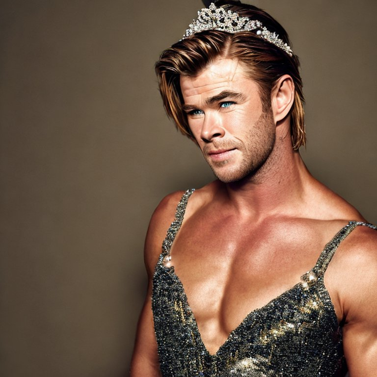

# Seeing Is No Longer Believing: A Survey on the State of Deepfakes and Other Nonveridical Media

There are several components to this repo:
1. a few examples of deepfakes we generated (e.g., of Chris Hemsworth in a tiara)

Stable Diffusion 1            |  Stable Diffusion 2.1            |  Stable Diffusion 2.1                     | Stable Diffusion 2.1
:-------------------------:|:-------------------------:|:-------------------------:|:-------------------------:
  |    |   | 

2. a background study on the history and evolution of deepfakes (including visualizations for bibliometric data, usage metrics, etc.)
1. the results of a user study wherein 260 participants were presented with 20 images (a combination of real and fake), and asked which ones they believed where real, which ones they believed were fake, and why.
