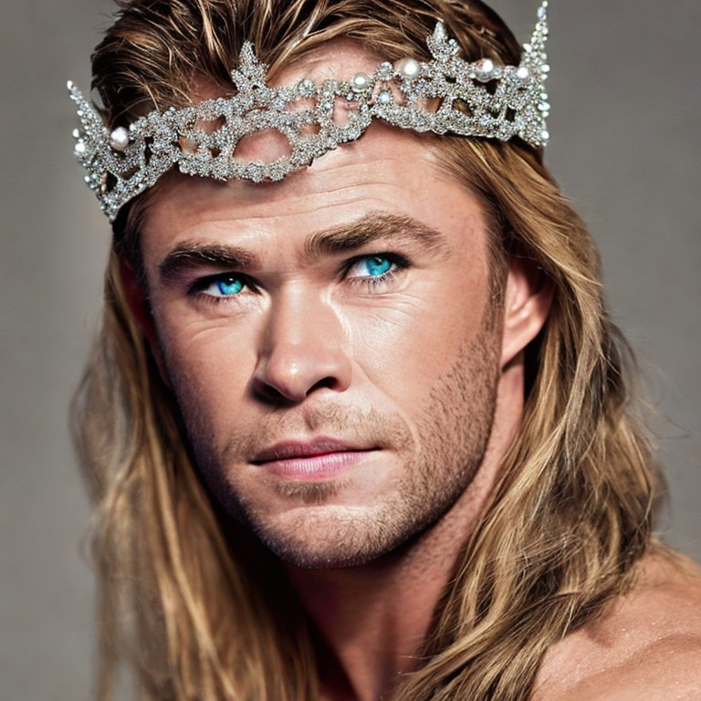

# Seeing Is No Longer Believing: A Survey on the State of Deepfakes and Other Nonveridical Media

Note: This paper has been accepted to CGI 2023.

There are several components to this repo:
1. a few examples of deepfakes we generated (e.g., of Chris Hemsworth in a tiara)

Stable Diffusion 1            |  Stable Diffusion 2.1            |  Stable Diffusion 2.1                     | Stable Diffusion 2.1
:-------------------------:|:-------------------------:|:-------------------------:|:-------------------------:
  |    |   | 

2. a background study on the history and evolution of deepfakes (including visualizations for bibliometric data, usage metrics, etc.). [CS Rankings](https://csrankings.org/#/index) was used to determine the most prolific institutions for deepfake research. The Semantic Scholar UI was used to determine the number of deepfake papers published over the years. 
1. the results of a [user study](https://docs.google.com/forms/d/e/1FAIpQLSfiGjsBgBoocsFTsWCe4aypm6zpykkKzbn0QgX5CXUNdfpUBQ/viewform?fbzx=-1358400270121316312) wherein 260 participants were presented with 20 images (a combination of real and fake), and asked which ones they believed where real, which ones they believed were fake, and why.

The link to our published paper is incoming.
